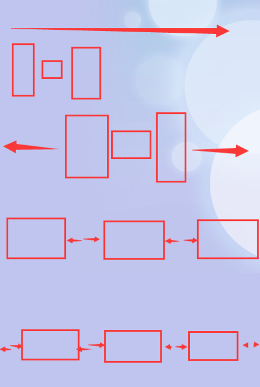

# react-native-01
react-native培训之基础与入门

# 培训目录

一，认识ReactNative  
    &nbsp;&nbsp;&nbsp;&nbsp;1.1,什么是Virtual DOM ？ 
    &nbsp;&nbsp;&nbsp;&nbsp;1.2,ReactNative的实现原理 
    &nbsp;&nbsp;&nbsp;&nbsp;1.3,ReactNative架构图 
二，Windows平台下环境的配置 
    &nbsp;&nbsp;&nbsp;&nbsp;2.1,使用工具 
    &nbsp;&nbsp;&nbsp;&nbsp;2.2,安装react-native-cli 
    &nbsp;&nbsp;&nbsp;&nbsp;2.3,安装jdk1.8或以上 
    &nbsp;&nbsp;&nbsp;&nbsp;2.4,配置jdk环境变量 
    &nbsp;&nbsp;&nbsp;&nbsp;2.5,Android Studio下载安装 
    &nbsp;&nbsp;&nbsp;&nbsp;2.6,安装Genymotion（可选） 
    &nbsp;&nbsp;&nbsp;&nbsp;2.7,安装过程中遇到错误解决方案 
三，初始化React-native项目 
    &nbsp;&nbsp;&nbsp;&nbsp;3.1,React-native初始化项目 
    &nbsp;&nbsp;&nbsp;&nbsp;3.2,React-native运行 
    &nbsp;&nbsp;&nbsp;&nbsp;3.3,React-native运行错误 
    &nbsp;&nbsp;&nbsp;&nbsp;3.4,React-native真机调试 
四，开发工具的选择 
五，React-Native基础 
    &nbsp;&nbsp;&nbsp;&nbsp;5.1,初始React-Native组件 
    &nbsp;&nbsp;&nbsp;&nbsp;5.2,React-Native 创建组件 
    &nbsp;&nbsp;&nbsp;&nbsp;5.3,React-Native生命周期 
    &nbsp;&nbsp;&nbsp;&nbsp;5.4,导入与导出 
    &nbsp;&nbsp;&nbsp;&nbsp;5.5,React-Native的State状态 
    &nbsp;&nbsp;&nbsp;&nbsp;5.5,React-Native的ref使用 
六，作业React-Native布局 

# 相关链接

http://www.oracle.com/technetwork/java/javase/downloads/index.html JDK下载

https://jingyan.baidu.com/article/6dad5075d1dc40a123e36ea3.html  JDK环境变量的配置

https://developer.android.google.cn/studio/index.html  Android Studio下载

http://reactnative.cn/docs/0.49/getting-started.html#content Android Studio安装配置

https://www.genymotion.com/download  genymotion模拟器下载地址

https://race604.com/react-native-component-lifecycle/  ReactNative生命周期

http://reactnative.cn/  ReactNative中文网

http://reactnative.cn/docs/0.49/layout-with-flexbox.html#content  使用Flexbox布局

# 练习
熟练使用FlexBox各种属性，完成下列图片布局 

